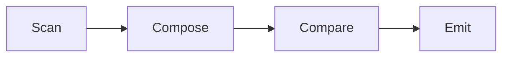

# Cite

[](https://hex.pm/packages/cite)
[](https://hexdocs.pm/cite)
[](https://github.com/mdepolli/cite/actions/workflows/ci.yml)

Citations copied from the source, never written by a model. Your code lists
the candidates — a line in a transcript, a row, a sentence — a decision model
judges which ones hold up, and Cite returns those exact bytes.

```elixir
client = Cite.new(Cite.Provider.TypeSafe, api_key: System.fetch_env!("JEV_API_KEY"))

candidates =
  Cite.Candidate.from_segments([
    %{text: "Why is a raven like a writing-desk?", meta: %{speaker: "Hatter"}},
    %{text: "Take some more tea.", meta: %{speaker: "March Hare"}},
    %{text: "Your hair wants cutting.", meta: %{speaker: "Hatter"}}
  ])

riddle = fn %{id: id} ->
  Cite.Question.noul(
    question: "Does `candidates.#{id}.text` pose a riddle?",
    inspect: "`candidates.#{id}.text`",
    true: "A question asked to be puzzled over, whether or not it has an answer.",
    false: "A plain question, a statement, or a remark."
  )
end

spec = %{
  atomics: [%{name: "riddle", question: riddle}],
  compose: fn index, candidates ->
    for c <- candidates, index[c.id]["riddle"],
        do: Cite.Cluster.new(id: c.id, class: "riddle", members: [c], state: %{}, questions: %{})
  end
}

source = Enum.map_join(candidates, " ", & &1.text)
%Cite.Result{spans: spans} = Cite.select(client, source, candidates, spec)
# [
#   %Cite.Span{text: "Why is a raven like a writing-desk?", byte_start: 0, byte_end: 35, class: "riddle", ...}
# ]
```

A decision model answers narrow typed questions — a probability, a level, a
choice — with calibrated confidence. It never generates text, so it cannot
misquote the source: the span above is `binary_part(source, 0, 35)`, and the
tea and the haircut were scored and dropped, not paraphrased. Compose is where
your code decides what a finding is; here every hit is one. The Quick Start
adds a second question that verifies each hit before it is cited.

## Installation

Add `cite` to your list of dependencies in `mix.exs`:

```elixir
def deps do
  [
    {:cite, "~> 0.1.0"}
  ]
end
```

Cite uses [Req](https://hex.pm/packages/req) for HTTP calls. No additional
adapter configuration is needed.

## Quick Start

### 1. Build a client

```elixir
client = Cite.new(Cite.Provider.TypeSafe, api_key: System.fetch_env!("JEV_API_KEY"))
```

The client is a function: `request -> {:ok, verdict} | {:error, reason}`.
Build it once, where your credentials live, and pass it in. Any function of
that shape works — see [Testing without a key](#testing-without-a-key).

### 2. Make candidates

```elixir
candidates =
  Cite.Candidate.from_segments([
    %{text: "Why is a raven like a writing-desk?", meta: %{speaker: "Hatter"}},
    %{id: "hare-1", text: "Take some more tea.", meta: %{speaker: "March Hare"}}
  ])

source = Enum.map_join(candidates, " ", & &1.text)
```

A candidate is anything your code can enumerate: a line of dialogue, a table
row, a sentence. `from_segments/1` trims each text, assigns `C000`, `C001`, … unless
you give an `:id`, and records byte offsets into the space-joined document.
`meta` is yours — Cite passes it to the model and never reads it.

The offsets are only right for that exact join, so build `source` with
`Enum.map_join(candidates, " ", & &1.text)`. `Cite.select/5` checks every
candidate against `source` before it spends a single request.

### 3. Write atomics

```elixir
riddle = fn %Cite.Candidate{id: id} ->
  Cite.Question.noul(
    question: "Does `candidates.#{id}.text` pose a riddle?",
    inspect: "`candidates.#{id}.text`",
    true: "A question asked to be puzzled over, whether or not it has an answer.",
    false: "A plain question, a statement, or a remark."
  )
end

atomics = [%{name: "riddle", question: riddle}]
```

An atomic is one question asked of every candidate. The scan puts each
window of candidates under `"candidates"` in the request state, so questions
address a line as `` `candidates.#{id}.text` `` — the model reads only what
the path points at. The scan's output is an index,
`%{candidate_id => %{atomic_name => probability}}`, with scores at or below
`atomic_threshold` dropped.

### 4. Write compose

```elixir
unanswered =
  Cite.Question.noul(
    question: "Is the riddle in `line.text` left without an answer in the line itself?",
    inspect: "`line.text`",
    true: "The line asks and does not answer.",
    false: "The line supplies or hints at the answer."
  )

compose = fn index, candidates ->
  for {id, %{"riddle" => _}} <- index, member = Enum.find(candidates, &(&1.id == id)) do
    Cite.Cluster.new(
      id: "riddle:#{id}",
      class: "riddle",
      members: [member],
      state: %{"line" => member},
      questions: %{"unanswered" => unanswered}
    )
  end
end
```

Compose is your code turning the index into clusters: the candidates that
together evidence one finding, with the questions that will verify it. A
cluster carries its own small `state` — put candidates in it directly, Cite
wires them as `id`, `text`, and their `meta` — and its compare questions
address that state (`` `line.text` ``). Compose never calls the model; it is
a pure function of the index, and the tests treat it as one.

### 5. Select

```elixir
%Cite.Result{spans: spans, errors: errors} =
  Cite.select(client, source, candidates, %{atomics: atomics, compose: compose})
```

Scan, compose, compare, emit. Every span is a byte-exact slice of `source`
with the cluster's `class` and the labelled answers in `attributes`; every
failed request is a `Cite.Error` with the byte range and candidate ids it
covered. The run never raises on the model's account — only on yours.

## Windows and overflow

The scan sends `window_size` candidates per request (default 40). A request
the provider refuses as too large (`{:error, :request_too_large}`) is split
in half and both halves are sent; only a single candidate that still
exceeds the cap becomes an error.

Windows are judged one after another. A long document is one request per
window, each up to 120 seconds plus retries. Concurrency is not yet an
option.

## The review band

Compare Nouls gate each cluster through `review_band` `{low, high}`
(default `{0.4, 0.6}`):

| `match` | Reject when | Accept when | Otherwise |
| ------- | ----------- | ----------- | --------- |
| `:all` (default) | any Noul ≤ `low` | every Noul ≥ `high` | review |
| `:any` | no Noul > `low` | any Noul ≥ `high` | review |

A reviewed cluster is emitted with `"review" => true` in its attributes so a
person decides. A cluster whose questions are all Scores and Choices has
nothing to gate and is accepted once judged; a cluster with no questions at
all is accepted without a request. Rejected clusters land in
`Result.rejected` with their answers.

A reply that skips a question is not read as "no": the model promises one
answer per question, so the whole request is recorded as a `Cite.Error`
(`{:missing_answers, keys}`) and nothing from it enters the index.

## Grounding members

By default every member of an accepted cluster becomes a span. Name the
question that verifies a member and it is grounded only when that Noul
clears the reject edge:

```elixir
Cite.Cluster.new(
  id: "riddles",
  class: "riddle",
  members: [c0, c5],
  state: %{"lines" => [c0, c5]},
  questions: %{
    "unanswered:C000" => unanswered.("C000"),
    "unanswered:C005" => unanswered.("C005")
  },
  member_questions: %{"C000" => ["unanswered:C000"], "C005" => ["unanswered:C005"]},
  match: :any
)
```

Here `unanswered.("C000")` builds the per-member Noul, addressing
`` `lines.C000.text` ``. Members not named in `member_questions` are always
evidence. A cluster that clears the gate but grounds no member is rejected —
it has nothing to cite.

## Labels

Every non-Noul question in a cluster labels the emitted spans under its own
key:

| Question | Label | Below `confidence_floor` |
| -------- | ----- | ------------------------ |
| `Cite.Question.score/1` | `round(score)` — the level index, 0-based | `"uncertain"` |
| `Cite.Question.choice/1` | the chosen option | `"uncertain"` |

Cite knows no question names. Map level indexes to your own words on your
side of the boundary — `0/1/2` to `sensible/odd/nonsense`, say — where that
vocabulary belongs. The raw answers are always in `attributes["compare"]`.

## State and meta on the wire

Each request carries `state` (yours, from the `:state` option) merged with
the stage's own: the scan adds `"candidates"`, compare adds the cluster's
`state`. Atom keys become strings; a `%Cite.Candidate{}` anywhere in the tree
becomes `%{"id" => …, "text" => …}` plus its `meta`; a *list* of candidates
becomes an object keyed by id that keeps their order on the wire, which a
plain map does not past 32 entries — and the model reads neighbours. Structs
other than candidates and keys that are neither atoms nor binaries are
rejected before the first request.

The `"candidates"` key is the scan's; a `:state` that uses it is rejected.

## Errors and diagnostics

`Cite.select/5` raises on your mistakes — a bad option, a candidate whose
offsets do not slice `source` to its text, a cluster naming a member that is
not a candidate — and always before the first request. Anything the model or
the network did is a value:

```elixir
%Cite.Result{
  spans: [...],
  errors: [%Cite.Error{byte_start: 0, byte_end: 412, candidate_ids: ["C000", ...], reason: :server_error}],
  usage: %{input_tokens: 48_120, output_tokens: 0},
  scan: %{"C000" => %{"riddle" => 0.91, ...}, ...},
  rejected: %{"riddle:C002" => %{"members" => ["C002"], "answers" => %{...}}}
}
```

`scan` is every candidate's score before thresholding; `rejected` is every
cluster that reached compare and failed, with its answers. A run is
diagnosable without another request. Candidates in a failed window have no
`scan` row, so compose should look them up with `Map.get/2`.

`Result`, `Span`, and `Error` encode with Jason or the built-in `JSON`; an
`Error`'s reason is passed through when it is JSON-safe and `inspect`ed when
it is not.

## Options

| Option | Default | Meaning |
| ------ | ------- | ------- |
| `window_size` | `40` | candidates per scan request |
| `atomic_threshold` | `0.5` | scan scores at or below this are dropped from the index |
| `review_band` | `{0.4, 0.6}` | reject at or below `low`, accept at or above `high` |
| `confidence_floor` | `0.5` | Score and Choice labels below this read `"uncertain"` |
| `state` | `%{}` | merged under every request's state |

## Testing without a key

The client is a function, so a test's client is a function:

```elixir
client = fn %{"questions" => questions} ->
  answers = Map.new(questions, fn {key, _} -> {key, %{"noul" => 0.9}} end)
  {:ok, %{answers: answers, usage: nil}}
end

%Cite.Result{spans: spans} = Cite.select(client, source, candidates, spec)
```

Everything from the scan request to the emitted spans runs for real; only
the model is stubbed. `Cite.Provider.TypeSafe` itself is tested with
[`Req.Test`](https://hexdocs.pm/req/Req.Test.html) — pass
`req_options: [plug: {Req.Test, name}]` to `Cite.new/2`.

## Providers

`Cite.new/2` builds a client from any module implementing `Cite.Provider`.
`Cite.Provider.TypeSafe` ships with the library and talks to
[TypeSafe](https://typesafe.ai)'s Jev — what TypeSafe calls a System One
model. Its options: `:api_key` (or `JEV_API_KEY`), `:model`
(`"jev-1.13.0"`), `:base_url`, and `:req_options`, merged into the Req client
last.

A provider raises on your mistakes and returns `{:error, reason}` for
anything the network did. One reason is shared across providers,
`:request_too_large`, which is what the scan halves windows on.

The TypeSafe provider retries rate limits (429), overloads (529), server
errors (500–504), and connection failures up to three times, honouring
`Retry-After` with delays capped at 30 seconds. Timeouts are not retried: a
120-second call retried is eight minutes, and a slow success would be billed
twice. Retries are Req's; what reaches the provider has already had them.

## How It Works



| Stage | Module | Role |
| ----- | ------ | ---- |
| Scan | `Cite.Scan` | every atomic of every candidate, in windows; answers become the index |
| Compose | yours | index → clusters |
| Compare | `Cite.Compare` | one request per cluster on its own state; the review band decides |
| Emit | `Cite.Emit` | grounded members → byte-exact spans with labels |

`Cite.Select` is the shell: it chunks, calls the client, halves a window on
overflow, calls again per cluster, and assembles the `Result`. Every decision
lives in a pure module and is tested with literal maps; the shell's tests are
the only ones that need a stub client. `Cite.Wire` is the one place values
become request maps; `Cite.Answer` the one place replies are read.

## Architecture

```
lib/cite/
├── provider/
│   └── typesafe.ex      # TypeSafe System One over Req
├── answer.ex            # reading one answer: noul value, score/choice label
├── candidate.ex         # Candidate.from_segments/1: ids, trimmed text, byte offsets
├── cluster.ex           # Cluster.new/1: members, state, questions, match
├── compare.ex           # cluster → request; verdicts → accepted/rejected
├── emit.ex              # accepted clusters → spans
├── error.ex             # a failed request: byte range, candidate ids, reason
├── provider.ex          # the Provider behaviour and error policy
├── question.ex          # Question.noul/score/choice and the wire encoding
├── result.ex            # spans, errors, usage, scan, rejected
├── scan.ex              # candidates → requests; verdicts → index
├── select.ex            # the shell: windows, calls, retries, assembly
├── span.ex              # a byte-exact slice with class and attributes
└── wire.ex              # values → request maps
```

## Stability

The docs group modules by tier; SemVer applies to the **Core API** tier.

**Core API** — the contract. `Cite` is the entry point. The structs it hands
out are stable to match on: `Result`, `Span`, `Error`. The inputs are built
with their constructors, not struct literals: `Candidate.from_segments/1`,
`Question.noul/1`, `score/1`, `choice/1`, `Cluster.new/1`.

**Providers** — `Cite.Provider` is implementable; with one implementation
in the wild it may be reshaped in minor releases, changelog-noticed.
`Cite.Provider.TypeSafe` is stable through the options `Cite.new/2`
documents.

**Internal** — no guarantees: `Select`, `Scan`, `Compare`, `Emit`, `Wire`,
`Answer`. Their docs stay published because they explain how the library
works, not because they are API.

## License

MIT — see the
[LICENSE](https://github.com/mdepolli/cite/blob/main/LICENSE) file for
details.
