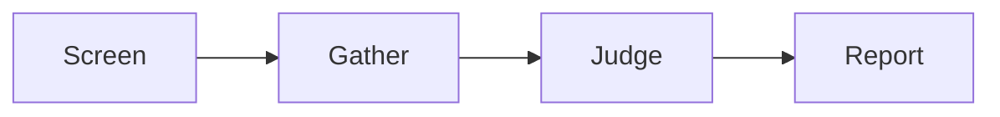

# How judging works

What happens between `Cite.judge/4` and the report, with the requests the
client receives at each step.



| Step | Module | What it does |
| ---- | ------ | ------------ |
| Screen | `Cite.Screen` | every indicator of every passage, a window per request |
| Gather | `Cite.Gather` | fixed rules turn matches into findings; no model call |
| Judge | `Cite.Judge` | one request per finding, on its own evidence |

`Cite.Run` is the shell: it calls the client, halves an oversized window,
and assembles the `Cite.Report`. Every decision lives in the three pure
modules, which never see the client.

## Round 1: screen

Every indicator — filters, directly screened concerns, factors — is asked of
every passage, `window` passages per request. The window sits under the
source's `as`, keyed by id, in source order:

```json
{
  "state": {
    "utterances": {
      "U014": {"id": "U014", "speaker": "B", "text": "we're behind on the mortgage"},
      "U015": {"id": "U015", "speaker": "A", "text": "Let's look at the cashflow chart."}
    }
  },
  "questions": {
    "U014:cashflow_stress": {
      "type": "noul",
      "instructions": {
        "question": "Does `utterances.U014.text` say the speaker's household is currently struggling with money?",
        "inspect": "`utterances.U014.text`"
      },
      "criteria": {"true": {"what": "..."}, "false": {"what": "...", "not_for": "..."}}
    }
  }
}
```

Question keys are `"<passage id>:<indicator>"`. A score above `threshold` is
a match; `threshold` only sets recall, the review band decides later.

A request the provider refuses as `:request_too_large` is halved and both
halves sent. Only a lone passage over the cap becomes an error, and its
remaining siblings are recorded as the same error without a call.

## Between rounds: gather

Fixed rules, no model call:

- A passage that fails any filter is set aside. So is a passage whose window
  failed: it has no scores.
- With `exclusive true`, a passage matching several directly screened
  concerns stays only with the highest-scoring one; the concern declared
  first wins a tie.
- A directly screened concern gathers every remaining match into one
  finding. Past `max_evidence` it keeps the strongest; the rest are the
  finding's `over_cap` and are never judged.
- A concern built from factors fills each role with its strongest match. A
  distinct role takes the strongest match no other role holds. A required
  role left empty means no finding.

## Round 2: judge

One request per finding.

A directly screened concern puts its passages under `as`, so siblings give
each other context. Fits are keyed `fit:<passage id>`; descriptors compare
every passage:

```json
{
  "state": {
    "utterances": {
      "U014": {"id": "U014", "speaker": "B", "text": "we're behind on the mortgage"},
      "U031": {"id": "U031", "speaker": "B", "text": "by the end of the month there's nothing left"}
    }
  },
  "questions": {
    "fit:U014": {"type": "noul", "instructions": {"question": "Does `utterances.U014.text` evidence ...", "inspect": "`utterances.U014.text`"}, "criteria": {"...": "..."}},
    "fit:U031": {"type": "noul", "instructions": {"question": "Does `utterances.U031.text` evidence ...", "inspect": "`utterances.U031.text`"}, "criteria": {"...": "..."}},
    "severity": {"type": "score", "instructions": {"question": "...", "compare": ["`utterances.U014.text`", "`utterances.U031.text`"]}, "criteria": ["...", "...", "..."]}
  }
}
```

A concern built from factors puts each role at the top level and asks the
checks that apply:

```json
{
  "state": {
    "household": {"id": "U003", "speaker": "B", "text": "we've got two kids at home"},
    "income": {"id": "U009", "speaker": "B", "text": "I'm on about sixty a year"}
  },
  "questions": {
    "same_household": {
      "type": "noul",
      "instructions": {
        "question": "Do `household.text` and `income.text` describe the same household?",
        "compare": ["`household.text`", "`income.text`"]
      },
      "criteria": {"true": {"what": "..."}, "false": {"what": "..."}}
    },
    "severity": {"type": "score", "instructions": {"question": "...", "compare": ["`household.text`", "`income.text`"]}, "criteria": ["...", "...", "..."]}
  }
}
```

A round-2 request refused as too large is that finding's error; it is not
split, because the descriptors read all of the evidence at once.

## Verdict rules

With `{low, high}` as the review band:

- **Evidence of a directly screened concern.** A passage whose fit is at or
  below `low` is dropped; below `high` it is cited as `:review`; at or above
  `high`, as `:holds`.
- **Evidence of a concern built from factors.** Every passage filling a role
  is cited as `:holds`, once, even if it fills several roles.
- **`:fails`**: any asked check at or below `low`, or no evidence left.
- **`:holds`**: every asked check at or above `high`, and at least one
  citation holds.
- **`:review`**: everything else.

## Replies

The client's reply is checked once, in the shell. A reply that skips a
question, or answers one in a shape its type cannot have, is not a verdict
on it: the whole request becomes a `Cite.Error` with
`{:missing_answers, keys}` or `{:malformed_answers, keys}`, and nothing from
it is read.
